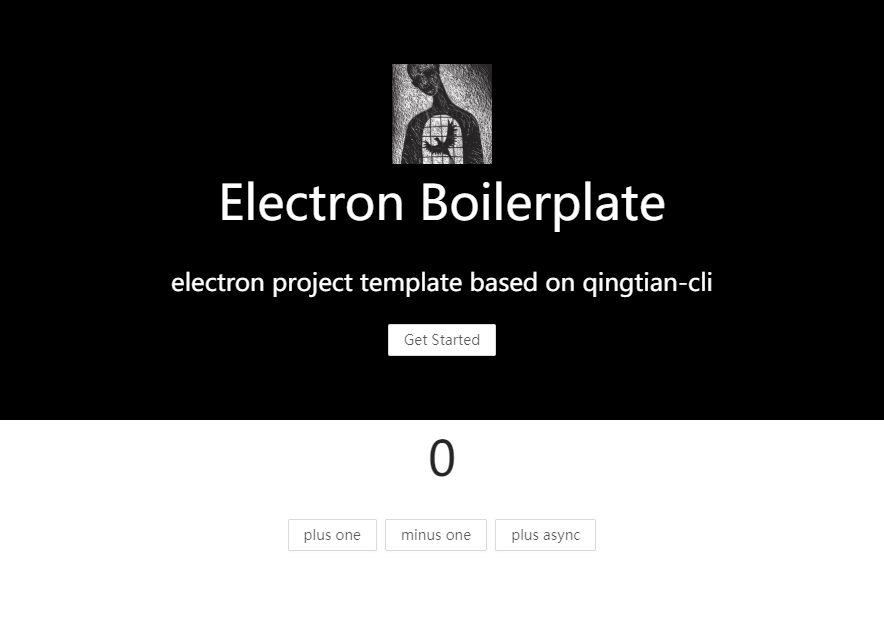

# electron-boilerplate

> react + typescript + electron 项目模板

# Installation

## 1.

```
yarn global add qingtian-cli
```

## 2.

```
qt new your-project-name -t electron
```

or

```
git clone https://github.com/xieqingtian/electron-boilerplate.git your-project-name

cd your-project-name

yarn
```

# Starting Development

```
yarn start
```

# Building for Production

```
yarn build
```

# Reference

-   打包问题若遇到下载问题参考[这里](https://blog.csdn.net/u010982507/article/details/101236913)

# Display


